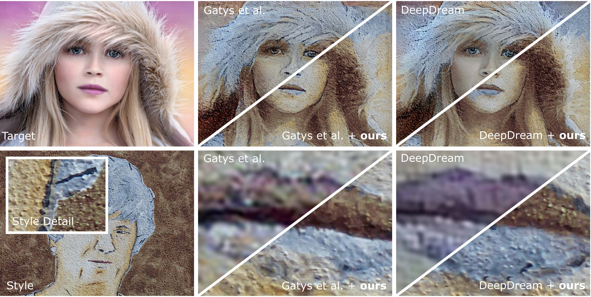
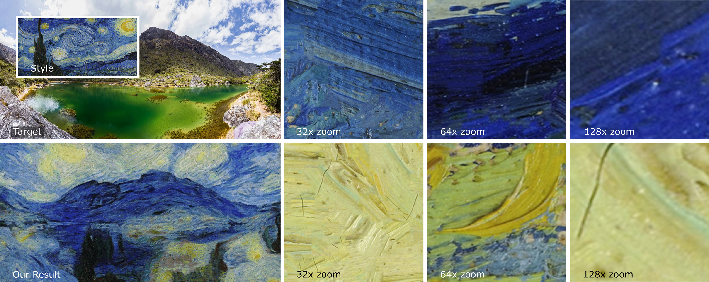

# Neurally-Guided-Style-Transfer

The official implementation of algorithms described in papers:

> **(1) Arbitrary Style Transfer Using Neurally-Guided Patch-Based Synthesis** </br>
_[O. Texler](https://ondrejtexler.github.io/), [D. Futschik](https://dcgi.fel.cvut.cz/people/futscdav),
[J. Fišer](https://research.adobe.com/person/jakub-fiser/), [M. Lukáč](https://research.adobe.com/person/michal-lukac/), 
[J. Lu](https://research.adobe.com/person/jingwan-lu/), [E. Shechtman](https://research.adobe.com/person/eli-shechtman/), 
and [D. Sýkora](https://dcgi.fel.cvut.cz/home/sykorad/)_ </br>
[[`WebPage`](https://ondrejtexler.github.io/neurally_guided/index.html)],
[[`Paper`](https://ondrejtexler.github.io/res/CAG_main.pdf)],
[[`BiBTeX`](#CitingNeurallyGuided)]
<!-- In Computers & Graphics (Elsevier, January 2020) -->

> **(2) Enhancing Neural Style Transfer using Patch-Based Synthesis** </br>
_[O. Texler](https://ondrejtexler.github.io/),
[J. Fišer](https://research.adobe.com/person/jakub-fiser/), [M. Lukáč](https://research.adobe.com/person/michal-lukac/), 
[J. Lu](https://research.adobe.com/person/jingwan-lu/), [E. Shechtman](https://research.adobe.com/person/eli-shechtman/), 
and [D. Sýkora](https://dcgi.fel.cvut.cz/home/sykorad/)_ </br>
[[`WebPage`](https://dcgi.fel.cvut.cz/home/sykorad/stylitneural.html)],
[[`Paper`](https://dcgi.fel.cvut.cz/home/sykorad/Texler19-NPAR.pdf)],
[[`Slides`](https://dcgi.fel.cvut.cz/home/sykorad/Texler19-NPAR.pptx)]
<!-- In Proceedings of the 8th ACM/EG Expressive Symposium, pp. 43-50 (Expressive 2019, Genoa, Italy, May 2019) -->

Neural based style transfer methods are capable of delivering amazing stylized imagery; however, the results are usually low-resolution,
blurred, contrast does not match the original style exemplar, and the image lacks many artistically essential details, e.g., brush-strokes, 
properties of the used artistic medium, or canvas structure.

This tool is designed to overcome the aforementioned drawbacks of neural based style transfer methods and allow for creating 
high-quality and extremely high-resolution images. The use-case is the following. 
* Let's assume we have a style exemplar and target photograph in high-resolution.
* First, we run these two images through our favorite neural-based style transfer method (see some tips in the [section below](#ExistingNeuralStyleTransferImplementations)). 
The result we get is of a low-resolution and does not represent the used style exemplar well.
* Second, we use this tool to restore the quality of the neural result and upscale it to the resolution of the style exemplar.

<p align='center'>
  
  <b>Portrait on a wall.</b> Target and Style are of 4000x3000 px. Neural results (Gatys et al. and DeepDream, top left triangles) were 
  generated in approximately 580x435 px. Neural results were then reconstructed and upscaled by this tool (Gatys et al.+ours and 
  DeepDream+ours, bottom right triangles) to the original resolution of 4000x3000.
</p>

<p align='center'>
  
  <b>Extremely large 346Mpix image.</b> Target and Style are of 26412x13127 px. The neural result (not shown here) was approximately 700x348 px. This result
  was then reconstructed and nearly 40 times upscaled by this tool to the original resolution. The right part of the figure shows 
  zoom-in patches. See all the individual brush strokes and its sharp boundaries. Also, notice how well the structure of the original canvas and
  little cracks of the painting are preserved.
</p>

## Build
#### On Windows 
* It depends on OpenCV and it expects `opencv_world420.dll` in your PATH. Pre-build DLL can be downloaded at https://opencv.org/opencv-4-2-0/, (or directly at [opencv-4.2.0-vc14_vc15.exe](https://sourceforge.net/projects/opencvlibrary/files/4.2.0/opencv-4.2.0-vc14_vc15.exe/download))
* The build script assumes VisualStudio to be installed (i.e., VisualStudio build tools, `cl.exe`, to be in PATH)
* Run `build-win.bat` it should output `styletransfer.exe`
* To build a faster version with GPU support, run `build-win_cuda.bat` (it assumes CUDA to be installed, `nvcc.exe` to be in PATH)

#### On Linux 
* Download and build OpenCV 4.2.0 (https://opencv.org/opencv-4-2-0/)
* Copy `libopencv_world.so`, `libopencv_world.so.4.2`, and `libopencv_world.so.4.2.0` to the `Neurally-Guided-Style-Transfer/opencv-4.2.0/lib`
* Do not forget to update your `LD_LIBRARY_PATH` to point to the `Neurally-Guided-Style-Transfer/opencv-4.2.0/lib`
* Run `build-linux.sh`, it should output `styletransfer` (it assumes `g++` to be installed)
* To build a faster version with GPU support, run `build-linux_cuda.sh` (it assumes CUDA to be installed, `nvcc` to be in PATH)

## Examples
* Once compiled successfully, explore and run `examples/wolf/run.bat` or `examples/wolf/run.sh`, there are several example scripts and an explanation of some parameters
* The result image should appear next to the scripts

## Parameters
* `--style <string>`, mandatory, path to the style image
* `--neural_result <string>`, mandatory, path to the neural result
* `--out_path <string>`, optional, output path, if not specified `--neural_result`+"_enhanced.jpg" is used instead 
* `--target <string>`, optional, has to be specified if you want to use `--guide_by_target` or `--recolor_by_target`
* `--guide_by_target`, optional, might help to restore some content of the target image, but also might make the result worse stylization-wise (target has to be perfectly aligned with neural_result)
* `--recolor_by_target`, optional, recolor the final result to have similar colors as the target image
* `--patch_based_source_blur <int>`, optional, specify how much the result is abstract
* `--patch_based_style_weight <float>`, optional, specify whether to follow style or content during the patch based synthesis
* `--patch_based_max_mp <float>`, optional, defines the maximal resolution (in megapixels) on which the patch based synthesis runs 
* `--patch_based_backend <string>`, optional, values are "CPU", "CUDA" or "AUTO"

## <a name="ExistingNeuralStyleTransferImplementations"></a>Existing Neural Style Transfer Implementations
There exist many great Neural Based Style Transfer papers and its implementations, the following are just a few of them:
* [[Gatys et al. 2015]](https://arxiv.org/pdf/1508.06576.pdf) A Neural Algorithm of Artistic Style
  * [Torch](https://github.com/jcjohnson/neural-style) and [PyTorch](https://github.com/ProGamerGov/neural-style-pt) implementation
  * [DeepArt.io](https://deepart.io/) - online web app by the original authors
* [DeepDreamGenerator](https://deepdreamgenerator.com/#tools)
  * There is a web app called Deep Style
* [[Gu et al. 2018]](https://arxiv.org/pdf/1805.04103.pdf) Arbitrary Style Transfer with Deep Feature Reshuffle
  * [C++ Caffe](https://github.com/msracver/Style-Feature-Reshuffle) implementation
* [[Liao et al. 2017]](https://arxiv.org/pdf/1705.01088.pdf) Visual Attribute Transfer through Deep Image Analogy
  * [C++ Caffe](https://github.com/msracver/Deep-Image-Analogy) implementation
* [[Li. et al. 2017]](https://arxiv.org/pdf/1705.08086.pdf) Universal Style Transfer via Feature Transforms
  * [Torch](https://github.com/Yijunmaverick/UniversalStyleTransfer), [PyTorch](https://github.com/sunshineatnoon/PytorchWCT), and [TensorFlow](https://github.com/eridgd/WCT-TF) implementation

## Credits
* This project started when [Ondrej Texler](https://ondrejtexler.github.io/) was an intern at [Adobe](https://www.adobe.com/), and it was funded by [Adobe Research](https://research.adobe.com/) and [Czech Technical University in Prague](https://www.cvut.cz/en) 
* As the underlying patch-based synthesis, this repository uses framework [EBSynth](https://github.com/jamriska/ebsynth) 
created and maintained by our colleague [Ondrej Jamriska](https://dcgi.fel.cvut.cz/people/jamriond).

## License
The code is released into the public domain. You can do anything you want with it.

However, you should be aware that the underlying patch-based synthesis framework EBSynth implements the PatchMatch algorithm, which is patented by Adobe (U.S. Patent 8,861,869). This repository does not necessarily depend on this particular EBSynth framework, and other patch-based synthesis solutions can be used instead. Also, EBSynth does not necessarily depend on PatchMatch, and other correspondence finding algorithms can be used instead.

## <a name="CitingNeurallyGuided"></a>Citing Neurally-Guided-Style-Transfer
If you find Neurally-Guided-Style-Transfer useful for your research or work, please use the following BibTeX entry.

```
@ARTICLE{Texler20-CAG,
  author  = {Ond\v{r}ej Texler and David Futschik and Jakub Fi\v{s}er and Michal Luk\'{a}\v{c} 
               and Jingwan Lu and Eli Shechtman and Daniel S\'{y}kora},
  journal = "Computers \& Graphics",
  title   = {Arbitrary Style Transfer Using Neurally-Guided Patch-Based Synthesis},
  year    = {2020},
}
```
